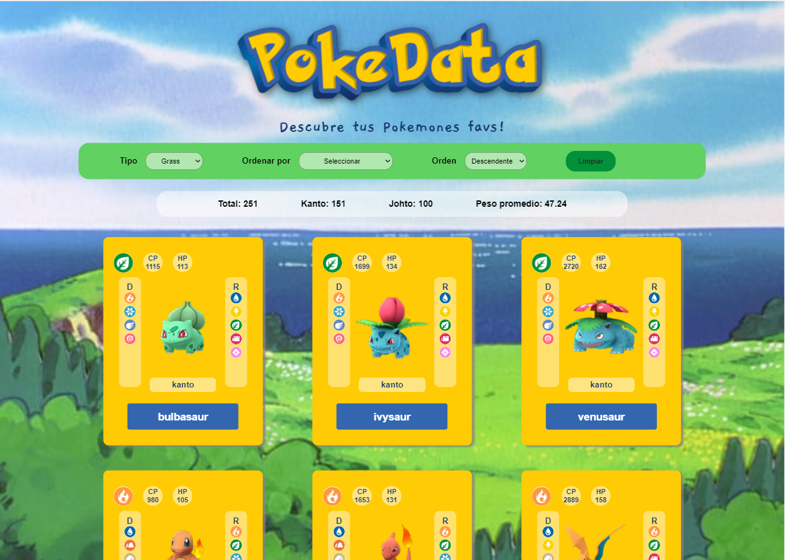

# Data Lovers

## Índice

* [1. Preámbulo](#1-preámbulo)
* [2. Descripción general del proyecto](#2-descripción-del-proyecto)
* [3. Objetivo](#3-objetivo)
* [4. Resumen del proyecto](#4-resumen-del-proyecto)
* [5. Historias de usuario](#5-historias-de-usuario)
* [6. Prototipos](#6-prototipos)
* [7. Funcionalidades](#7-funcionalidades)
* [8. Consideraciones técnicas](#8-consideraciones-técnicas)

***

## 1. Preámbulo

Según [Forbes](https://www.forbes.com/sites/bernardmarr/2018/05/21/how-much-data-do-we-create-every-day-the-mind-blowing-stats-everyone-should-read),
el 90% de la data que existe hoy ha sido creada durante los últimos dos años.
Cada día generamos 2.5 millones de terabytes de datos, una cifra sin
precedentes.

No obstante, los datos por sí mismos son de poca utilidad. Para que esas
grandes cantidades de datos se conviertan en **información** fácil de leer para
los usuarios, necesitamos entender y procesar estos datos. Una manera simple de
hacerlo es creando _interfaces_ y _visualizaciones_.

En la siguiente imagen, podrás ver cómo con la data que que se ve en la parte
izquierda se puede construir una interfaz amigable y entendible por las
usuarias, al lado derecho.


## 2. Descripción general del proyecto

Bienvenido a nuestro sitio web, creado para las fanáticas de Pokémon Go. Aquí encontrarás una amplia colección de Pokémon, con herramientas de filtrado y clasificación para personalizar tu búsqueda. Puedes filtrar por tipo, ordenar por características importantes en una batalla y obtener información valiosa. Además, puedes realizar búsquedas adicionales sin recargar la página. Nuestra plataforma es fácil de usar y accesible desde dispositivos móviles y computadoras. ¡Explora el mundo Pokémon con comodidad y precisión en nuestra página web!



## 3. Objetivo

El objetivo de la página es servir como una valiosa fuente de datos y recursos para la comunidad de aficionados de Pokémon Go. Pensado principalmente para la usuaria que desee acceder a información puntual sobre los diferentes Pokémon, permitiéndole seleccionar el que mejor se ajuste a sus necesidades y preferencias.

## 4. Resumen del proyecto

En este proyecto **construimos una _página web_ para visualizar un
_conjunto (set) de datos_** que se adecúa a lo que nuestra usuaria necesita, de acuerdo a la siguiente información:

Pokémon GO es una experiencia de juego internacional que cuenta con más de mil
millones de descargas y ha sido nombrada "el mejor juego para móviles" por
Game Developers Choice Awards y "la mejor aplicación del año" por TechCrunch
(tomado de Google Play). Los usuarios del juego se convierten en "Maestros/
entrenadores de Pokémon" y pueden:

- **Descubrir el mundo Pokémon:** explorar y descubrir nuevos Pokémon allá
  donde vayan.
- **Atrapar** distintos Pokémon para completar su Pokédex.
- **Pelear** contra Pokémon de otros entrenadores y conquistar un gimnasio.
- **Competir** en épicos combates contra otros entrenadores.
- **Hacer equipo** con otros entrenadores para atrapar poderosos Pokémon
  durante las incursiones.

## Hallazgos

Para entender mejor qué necesidades complementarias a la app tienen las
usuarias, hicimos una rápida investigación (research) y estos son algunos
de los hallazgos.

- Los Pokémon tienen características únicas que determinan las decisiones que
  toma el usuario (tipo, debilidad, peso, multiplicador, etc.)
- Un maestro Pokémon antes de salir a casar los Pokémon tienen que:
  saber el top 10 de frecuencia de aparición de los Pokémon.
- Los Pokémon tienen distintos tipos y debilidades de combate. Estas
  características son importantes cuando un maestro Pokémon elige al Pokémon
  más adecuado para su batalla. Hay veces que tiene que elegir a los que
  tienen menos cantidad de debilidades y saber de que tipo son. Por ello, es
  importante para un maestro Pokémon poder ordenarlos por estas 2
  características.
- Los Pokémon evolucionan y es importante para un
  maestro Pokémon saber cuántas y cuáles son las evoluciones que tienen antes y
  después.
- Los Pokémon se alimentan de caramelos y un maestro Pokémon necesita saber
  cuántos caramelos necesita un Pokémon para evolucionar.

El resultado es una página web que permite **visualizar la data,
filtrarla, ordenarla y calcular algunas estadística**. 

En este proyecto trabajamos con la siguiente data:

* [Pokémon](src/data/pokemon/pokemon.json):
  En este set encontramos una lista con los 251 Pokémon de la región de Kanto
  y Johto, junto con sus respectivas estadísticas usadas en el juego
  [Pokémon GO](http://pokemongolive.com).
 
## 5. Historias de usuario

### Historia de usuario 1: 
Yo como <<usuaria/interesada>>
quiero <<ver las características más importantes de un pokemon>>
para <<conocer y poder tomar decisiones mas acertadas en el juego>>

* Criterios de aceptación: 
  Al cargar la página se deben mostrar todos los pokemones de la data con sus      
  características mas importantes, como lo son el nombre, imagen, tipo, generación, puntaje máximo de salud, puntaje máximo de ataque, resistencias y debilidades.

* Definición de terminado: 
  - Se realizan prototipos de baja, media y alta para el diseño de la tarjetas y de la página.
  - Se importa la data al archivo `src/main.js`.
  - Se plantea la estructura HTML para la vista principal de la página (título, subtitulo, imagen de fondo, 
    elementos select para escoger el tipo, la característica por la cual se va a ordenar y el orden, el botón para limpiar y el pie de página).
  - Se le dan estilos CSS a todos los elementos HTML de la página y de la tarjeta de acuerdo al prototipo.
  - Se planteó y probó la función `renderItems(data)` para pintar la data, en el archivo `src/view.js`, con la cual 
    se genera de forma dínamica la estructura HTML necesaria para mostrar las características más importantes de cada pokemon, por medio de tarjetas.
  - Se importa la función `renderItems(data)` al archivo `src/main.js`, se selecciona el elemento <section> de 
    id="root", se llama la función con el atributo `data.pokemon` y el resultado de esta se remplaza en el elemento sectión, para que muestre todos los pokemones en sus respctivas tarjetas. 
  - Se planteó el evento correspondiente para que se limpien los filtros y se muestre la data completa cada vez que 
    la usuaria hace click en el botón limpiar. 

### Historia de usuario 2:
Yo como <<usuaria/interesada>>
quiero <<saber cuál es el top 10 pokemones>>
para <<poder elegir el que más me convenga>>

**No se desarrolló por falta de tiempo**

### Historia de usuario 3: 
Yo como <<usuaria/interesada>>
quiero <<ver los pokemones de determinado tipo>>
para <<conocer y poder decidir de forma rápida con qué pokemon pelear o a cual atrapar>>

* Criterios de aceptación:
  La aplicación debe permitir a la usuaria seleccionar el tipo de pokemon que desea ver y una vez seleccionado mostrar todos los pokemones de este tipo en las tarjetas y con sus características más importantes.

* Definición de terminado: 
  - Haber terminado la historia de usuario 1
  - Se planteó y probó la función `filterData(data, filterBy, value)` en el archivo `src/dataFuctions.js` para que  
    la data se filtre por tipo y deuelva el arreglo con todos los pokemones del tipo seleccionado.
  - Se importó la función `filterData(data, filterBy, value)` en el archivo `src/main.js`, se selecciona el   
    elemento <select> de id="filter" y se plantea el evento que capture la interacción de la usuaria con el elemento <select> y su valor (el tipo escogido por la usuaria) se utiliza como argumento para llamar a la función y obtener el arreglo de los pokemones filtrados por tipo.
  - Se pinta la data filtrada llamando la función `renderItems(data)`y con el arreglo de la data filtrada por 
    tipo como argumento.

### Historia de usuario 4: 
Yo como <<usuaria/interesada>>
quiero <<ver los pokemones de determinado tipo, ordenados por número de debilidades, en orden ascendente o descendente>>
para <<elegir al pokemon más adecuado para mi batalla>>

* Criterios de aceptación:
  La aplicación debe permitir a la usuaria seleccionar la opción "por Nro. de debilidades" para poder ver los pokemones filtrados por el tipo escogido, ordenados de forma descendente (como predetermidano) por el número de debiliddades de cada uno, pero también poder cambiar el orden a ascendente si así lo prefiere. 

* Definición de terminado: 
- Haber terminado la historia de usuario 3
- Se planteó y probó la función `sortData(data, sortBy, sortOrder)` en el archivo `src/dataFuctions.js` para que la 
  data filtrada se ordene por número de debilidades y deuelva una copia del arreglo recibido con los pokemones del tipo escogido por la usuaria, pero ordenados de forma descendente o ascendente, por esta característica.
- Se importó la función `sortData(data, sortBy, sortOrder)` en el archivo `src/main.js`, se selecciona el elemento 
  <select> de id="filter", el elemento <select> de id="sort" y el elemento <select> de id="sortOrder". Se plantea el evento que capture la interacción de la usuaria con los elementos <select> y su respectivos valores, los cuales se utilizan como argumentos para llamar a la función `filterData(data, filterBy, value)` y a la función `sortData(data, sortBy, sortOrder)` y así obtener el arreglo de los pokemones filtrados por tipo y ordenados por número de debilidades, en orden descendente o ascendente.
- Se pinta la data filtrada y ordenada llamando la función `renderItems(data)`y con el arreglo obtenido en el 
  punto anterior como argumento.

### Historia de usuario 5: 
Yo como <<usuaria/interesada>>
quiero <<ver los pokemones de determinado tipo, ordenados por puntaje de salud o puntaje de ataque y de forma descendente o ascendente>>
para <<elegir al pokemon más resistente para mi batalla>>

* Criterios de aceptación:
La aplicación debe permitir a la usuaria seleccionar la opción "puntaje de salud" o "puntaje de ataque" para poder ver los pokemones filtrados por el tipo escogido y ordenados de forma descendente o ascendente por alguna de estas características. 

* Definición de terminado: 
- Haber terminado la historia de usuario 4
- Se modificó y probó la función `sortData(data, sortBy, sortOrder)` en el archivo `src/dataFuctions.js` para que 
  la data filtrada se ordene por puntaje de salud o por puntaje de ataque, pues la forma de acceder a estas características en la data es diferente, y se debe plantear la función teniendo en cuenta que el parámetro "sortBy" puede tomar tambien estos valores. La función debe devolver una copia del arreglo recibido con los pokemones del tipo escogido por la usuaria, pero ordenados de forma descendente o ascendente por alguna de estas características.
- Se planteó el evento que capture la interacción de la usuaria con los elementos 
  'select' y su respectivos valores, los cuales se utilizan como argumentos para llamar a la función `filterData(data, filterBy, value)` y a la función `sortData(data, sortBy, sortOrder)`. De esta forma se obtine el arreglo de los pokemones filtrados por tipo y ordenados por cualquiera de las tres caracteristicas establecidas, en orden descendente o ascendente.
- Se pinta la data filtrada y ordenada llamando la función `renderItems(data)`y con el arreglo obtenido en el punto anterior como argumento.  

### Historia de usuario 6: 
Yo como <<usuaria/interesada>>
quiero <<ver cuantos pokemones se muestran en total y por tipo, además de la catidad que hay por cada generación>>
para <<conocer qué características específicas pueden tener, dependiendo de la generación a la que pertenecen>>

* Criterios de aceptación:
La aplicación debe permitir a la usuaria ver el número de pokemones de cada generación cada vez que se pinte la data.

* Definición de terminado: 
- Haber terminado la historia de usuario 3
- Se incluyó en la estructura HTML el elemento <nav> de class="dataAndQuantity" para mostrar los datos calculados.
- Se planteó y probó la función `filterGeneration(data, filterBy, value)` en el archivo `src/dataFuctions.js` para 
  filtrar la data recibida por generación y calcular el número de pokemones de cada una.
- Se llama la función `filterGeneration(data, filterBy, value)` cada vez que se pinte la data (cuando se carga la  
  página y cada vez que se filtra).
- Se actualizan los datos calculados en el elemento HTML correspondiente, para mostrarlos a la usuaria.

### Historia de usuario 7: 
Yo como <<usuaria/interesada>>
quiero <<conocer el peso promedio de los pokemones de acuerdo al tipo>>
para <<poder decidir qué pokemon es el más adecuado para pelear o para alguna batalla>>

* Criterios de aceptación:
La aplicación debe permitir a la usuaria ver el peso promedio de los pokemones mostrados, cuando se carga la página y cuando se filtra por algun tipo.

* Definición de terminado: 
- Haber terminado la historia de usuario 3
- Se planteó y probó la función `computeStats(data)` en el archivo `src/dataFuctions.js` para calcular el peso    
  promedio de los pokemones.
- Se llama la función `computeStats(data)` cada vez que se pinte la data (cuando se carga la página y cada vez que 
  se filtra).
- Se actualiza el peso promedio en el elemento HTML correspondiente, para mostrarlo a la usuaria.

## 6. Prototipos

Los prototipos de baja, media y alta fueron desarrollados en Figma y se pueden ver en el siguiente enlace: https://www.figma.com/file/OZpu8qlSRxO1SQmWRYVHxn/PokeData?type=design&node-id=0%3A1&mode=design&t=xG1eeTWMIO0lZhqu-1

## 7. Funcionalidades

Nuestra página web permite **visualizar la data,
filtrarla, ordenarla y calcular algunas estadísticas**.

Aquí definimos en más detalle las funcionalidades que tiene:

* La aplicación permite a la usuaria ver los items de la data en una visualización, tipo tarjetas, donde se 
  muestran características que consideramos importantes para nuestras usuarias; como lo son: nombre, imagen, tipo, puntaje máximo de salud, puntaje máximo de ataque, región de origen, número y tipo de debilidades y de resistencias . **Cada una de las tarjetas está contenida en un elemento `<li>` y estos a su vez contenidos en
  un elemento `<ul>`.**

* El elemento `<ul>` es hijo de un elemento `<section>`con atributo _id_
  de valor "root".

* La interfaz estructura semánticamente la data usando el estándar microdatos.Por medio de los atributos 
  `itemscope`, `itemtype` e `itemprop`.
  
* La aplicación calcula y visualiza el número de pokemones de cada región (kanto y johto) y el peso promedio de     
  estos, cuando se muestra la data total y cuando se filtra por cada uno de los tipos.

* La aplicación permite a la usuaria filtrar la data por tipo de pokemon. Para esto usamos un elemento 
  `<select>`con un atributo de datos `data-testid="select-filter"`, y un atributo `name` con el nombre
  de la propiedad por la que filtrará, en este caso "type". Los `<option>` de este `<select>`tienen en el atributo `value` el valor del filtro, que en este caso son los 18 tipos de pokemones que hay.

* La aplicación permite a la usuaria ordenar la data.
  - Por medio de un control `<select>`, con un atributo de datos `data-testid="select-sort"` y un atributo `name` con el nombre de la propiedad por la que ordenará, que en este caso son: Número de debilidades, puntaje de salud y puntaje de ataque.
  - Y un control `<select>`, con atributo `name="sort-order"`, y que tiene dos `<option>` con `value` `asc` y `desc`, para ordenar ascendente y descendente la data.
   
* Las funcionalidades de ordenar operan sobre la data filtrada.
  
* La aplicación permite a la usuaria reiniciar la aplicación, limpiando filtros y ordenamiento, con un `<button>` 
  con un atributo de datos `data-testid="button-clear"`.

* Las operaciones de filtrar, ordenar, limpiar, agregan el contenido en una manera dinámica via javascript.

* La aplicación es _responsive_, es decir, se visualiza sin problemas desde distintos tamaños de pantallas: 
  móviles, tablets y desktops.

## 8. Consideraciones técnicas

La lógica del proyecto está implementada completamente en JavaScript
(ES6), HTML y CSS. 

El _boilerplate_ contiene una estructura de archivos como punto de partida así
como toda la configuración de dependencias:

```text
.
├── EXTRA.md
├── README.md
├── package.json
├── src
|  ├── data 
|  |  ├── pokemon
|  |  |  ├── pokemon.js
|  |  |  ├── pokemon.json
|  |  |  └── README.md
|  |  └── // otras carpetas de data
|  ├── dataFunctions.js
   ├── view.js
|  ├── index.html
|  ├── main.js
|  └── style.css
└── test
   └── data.js
   └── data.spec.js
└── tests-read-only

```

### `src/index.html`

El archivo `index.html` contiene la estructura de la página que se mostrará a la usuaria. También nos sirve para indicar qué scripts se usarán y unir todo lo que hemos hecho.

### `src/main.js`

El archivo `src/main.js` contiene todo el código que tiene que ver con mostrar los datos en la pantalla. Con esto nos referimos básicamente a la interacción con el DOM. Operaciones como creación de nodos, registro de
manejadores de eventos (_event listeners_ o _event handlers_).

En este archivo encontrarás una serie de _imports_ para _cargar_la fuente de datos y las diferentes funciones.

### `src/dataFunctions.js`

Este proyecto se basa en la manipulación de datos a través de arreglos y objetos.

Este archivo `src/dataFunctions.js` contiene toda la funcionalidad que corresponde a obtener, procesar y manipular datos. Aquí encontramos las siguientes funciones:

* `filterData(data, filterBy, value)`: esta función nos permite filtrar la data por tipo y recibe tres parámetros.
  El primer parámetro, `data`, nos entrega los datos.
  El segundo parámetro, `filterBy`, nos dice con respecto a cuál de los campos de
  la data se quiere filtrar.
  El tercer parámetro, `value`, indica el valor de campo que queremos filtrar.

* `sortData(data, sortBy, sortOrder)`: esta función `sort` u ordenar, nos permite ordenar la data por número de
  debilidades, por puntaje de salud y por puntaje de ataque. Y recibe tres parámetros.
  El primer parámetro, `data`, nos entrega los datos.
  El segundo parámetro, `sortBy`, nos dice con respecto a cuál de los campos de
  la data se quiere ordenar.
  El tercer parámetro, `sortOrder`, indica si se quiere ordenar de manera
  ascendente o descendente.

* `filterGeneration(data, filterBy, value)`: esta función nos permite filtrar la data por generación para calcular  
  el número de pokemones de cada una, y recibe tres parámetros.
  El primer parámetro, `data`, nos entrega los datos.
  El segundo parámetro, `filterBy`, nos dice con respecto a cuál de los campos de
  la data se quiere filtrar.
  El tercer parámetro, `value`, indica el valor de campo que queremos filtrar.

* `computeStats(data)`: la función `compute` o calcular, nos permite calcular el peso promedio de los pokemones 
  mostrados, por medio del método reduce. Solo recibe el parámetro `data`, el cual nos entrega los datos.

### `src/data`

En esta carpeta están los datos de las diferentes fuentes. Encontrarás una
carpeta por cada fuente, y dentro de cada carpeta dos archivos: uno con la
extensión `.js` y otro `.json`. Ambos archivos contienen la misma data; la
diferencia es que el `.js` lo usaremos a través de una etiqueta `<script>`,
mientras que el `.json` está ahí para opcionalmente cargar la data de forma
asíncrona con [`fetch()`](https://developer.mozilla.org/es/docs/Web/API/Fetch_API)
(ver sección de [_Parte Opcional_](#7-hacker-edition)).

### `test/dataFunctions.spec.js`

En este archivo se realizan pruebas unitarias de las funciones
implementadas en el archivo `dataFunctions.js`. (`filterBy`, `sortBy`, etc.)

### `test/data.js`

En este archivo se exporta data "mock" para usar en los tests. Es una muestras de 7 pokemones, que usamos para probar nuestra funcionalidad.

### `src/view.js`

En este archivo planteamos la función renderItems con la cual pintamos la data al cargar la página y cuando se filtra u ordena, como se describe a continuación:
* `renderItems(data)`: esta función recibe el arreglo de data para renderizar
  los elementos de cada item, y devuelve el elemento `<ul>` que contiene los elementos `<li>` necesarios para mostrar cada uno de los items.
